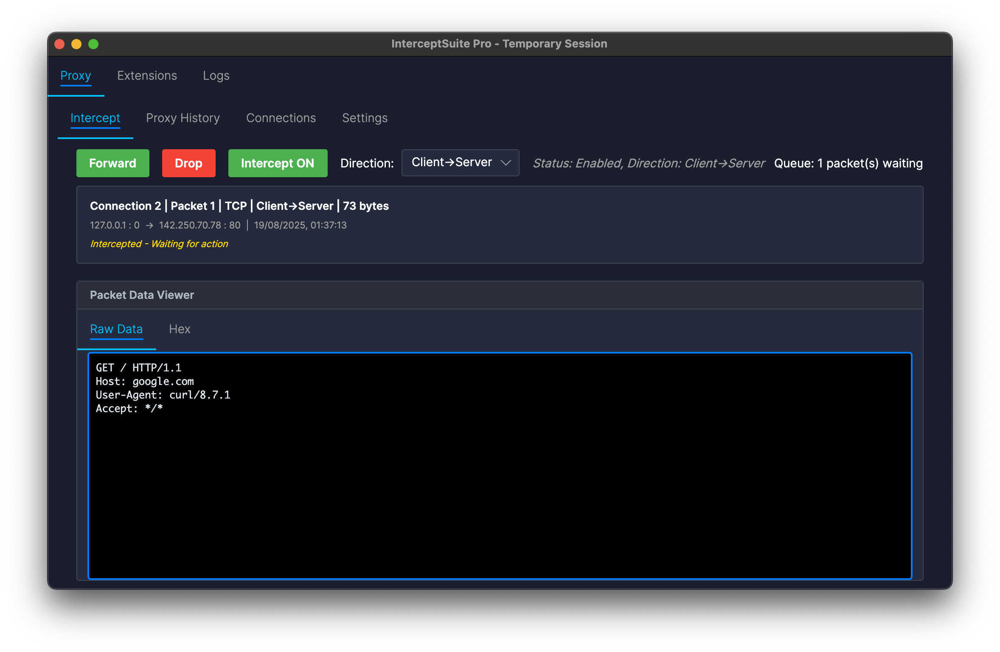
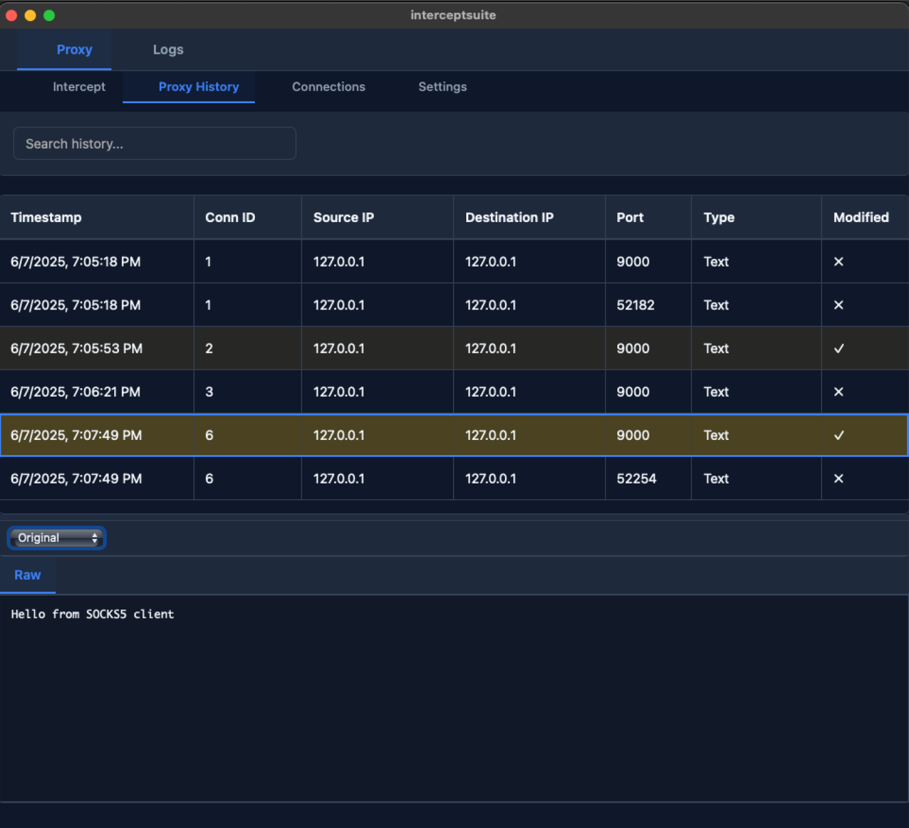
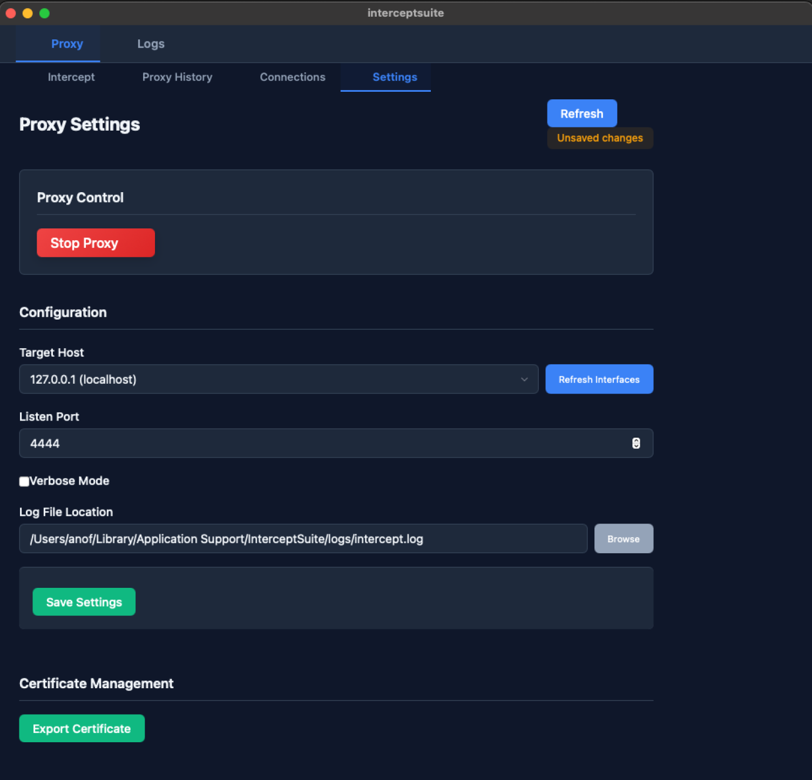
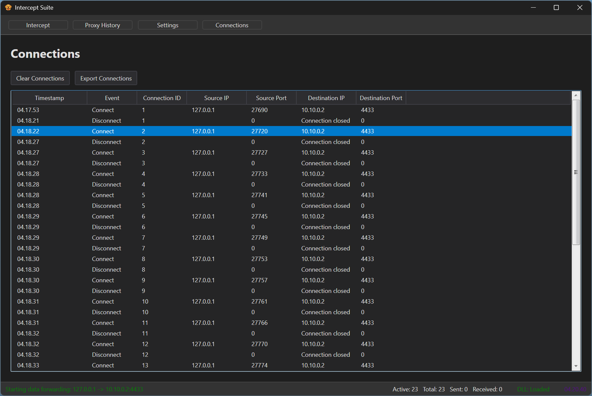

### TCP/UDP *TLS/SSL Traffic Interception & Analysis*
*Protocol TCP/TLS, STARTTLS, network traffic inspection that goes beyond traditional HTTP-only tools*

> **🚀 InterceptSuite PRO**: Looking for advanced features? Check out [**InterceptSuite PRO**](https://interceptsuite.com) with enhanced protocol support and priority features.

---

## 🌟 Overview

**InterceptSuite** is a cross-platform network traffic interception tool engineered for comprehensive TLS/SSL inspection, analysis, and manipulation at the network level. Unlike traditional tools such as Burp Suite or ZAP that focus specifically on HTTP/HTTPS traffic, InterceptSuite provides **unprecedented visibility** into any TLS-encrypted protocol, operating seamlessly at the TCP/TLS layer.

> **🚀 InterceptSuite PRO**: Looking for advanced features? Check out [**InterceptSuite PRO**](https://interceptsuite.com) with universal TLS upgrade detection that can perform MITM on any TCP-to-TLS transition, PCAP file export capabilities, and priority support. This repository contains the **free open-source version**.

### 🎯 The Challenge We Solve

The original inspiration behind InterceptSuite was to address a critical gap in application penetration testing. Security professionals often struggle with limited options for intercepting network traffic from native applications, making it challenging to perform comprehensive packet or traffic analysis of thick clients and custom protocols.

### 💡 Our Solution

InterceptSuite bridges this gap by providing a **universal TLS interception engine** that works with any protocol, giving security researchers the tools they need to analyze, understand, and test encrypted communications effectively. With **Python extension support**, users can add custom protocol dissection capabilities tailored to their specific needs.

### Platform Support

| Component | Windows | Linux | macOS |
|-----------|:-------:|:-----:|:-----:|
| Core Library | ✅ | ✅ | ✅ |
| GUI Interface | ✅ | ✅ | ✅ |

## Table of Contents

- [📚 InterceptSuite PRO](#-interceptsuite-pro)
- [🌟 Overview](#-overview)
- [✨ Features](#-features)
- [🚀 Getting Started](#-getting-started)
- [📖 Usage](#-usage)
- [🔧 Proxy Configuration](#-proxy-configuration)
- [🐍 Protocol Dissection & Python Extensions](#-protocol-dissection--python-extensions)
- [🤔 When to Use InterceptSuite vs. HTTP-Specific Tools](#-when-to-use-interceptsuite-vs-http-specific-tools)
- [🖼️ Screenshots](#️-screenshots--interface)
- [📄 License](#-license)
- [🙏 Acknowledgments](#-acknowledgments)

## 📚 InterceptSuite PRO

**Unlock the full potential of TLS traffic analysis with InterceptSuite PRO**

### 🌟 PRO Features

| Feature | Free Version | PRO Version |
|---------|:------------:|:-----------:|
| **🔐 Standard TLS Handshakes** | ✅ | ✅ |
| **🛠️ Traffic Manipulation** | ✅ | ✅ |
| **🛠️ Python Extension Support** | ✅ | ✅ |
| **📁 Project File Management** | ❌ | ✅ |
| **⚡ PCAP File Export** | ❌ | ✅ |
| **🔒 Universal TLS Upgrade Detection** | ❌ | ✅ |
| **🛡️ Any TCP-to-TLS MITM Capability** | ❌ | ✅ |
| **📧 STARTTLS Protocols** (SMTPS, IMAP, etc.) | ❌ | ✅ |
| **📁 FTPS with AUTH TLS Support** | ❌ | ✅ |
| **🐘 Database TLS Support** (PostgreSQL, MySQL, etc.) | ❌ | ✅ |

---

## ✨ Features

- **🌐 Protocol-Agnostic TLS Interception**: Intercept TLS/SSL traffic from any application or protocol
- **🔌 SOCKS5 Proxy Integration**: Uses SOCKS5 proxy protocol for versatile connection handling
- **⚡ Real-time Traffic Analysis**: View decrypted traffic as it flows through the proxy
- **🎛️ Connection Management**: Track active connections and view their details
- **🔐 Certificate Authority Management**: Automatic generation of CA certificates with platform-specific storage
- **🔧 Traffic Manipulation**: Modify intercepted traffic before forwarding
- **⚡ High-Performance C Core**: Optimized C engine for maximum speed and minimal memory footprint
- **📚 Custom Integration**: Embed TLS interception capabilities into your own applications with our DyLib, So and DLL
- **🎨 Modern GUI**: Built with Avalonia .NET for cross-platform native performance
- **📝 Detailed Logging**: Comprehensive logging with automatic rotation and cleanup
- **🐍 Python Extension Support**: Add custom protocol dissection with Python plugins

## 🚀 Getting Started

### Prerequisites

- **Windows 10/11 (64-bit)**, **Linux (x64)**, or **macOS 13+ (Apple Silicon)**

### Installation

1. **Download** the platform-specific installer from the [Releases page](https://github.com/anof-cyber/InterceptSuite/releases)
   - **Windows**: `.exe` installer
   - **Linux**: `.deb` (Ubuntu/Debian) or `.rpm` (RedHat/Fedora) package
   - **macOS**: `.pkg` installer package
2. **Run** the installer and follow the setup wizard
3. **Launch** InterceptSuite from your applications menu or desktop shortcut

> **Note:** Platform-specific native installers are available for seamless installation on all supported operating systems.

## 📖 Usage

For comprehensive setup and usage instructions, see our detailed **[Documentation](https://doc.interceptsuite.com)**.

### Quick Start

1. **Launch** InterceptSuite application
2. **Start** the proxy server (default: `127.0.0.1:4444`)
3. **Install** the generated CA certificate as a trusted root
4. **Configure** your client application to use the SOCKS5 proxy
5. **Begin** intercepting and analyzing TLS traffic

> **Important:** InterceptSuite generates a unique CA certificate on first run that must be installed as a trusted root certificate authority for TLS interception to work.

## GitAds Sponsored

## 🔧 Proxy Configuration

Configure your client application to use the SOCKS5 proxy at `127.0.0.1:4444`.

For detailed platform-specific configuration instructions, see the **[Usage Guide](Usage.md)** and **[Documentation](https://doc.interceptsuite.com)**.

### Platform Notes

- **Windows**: Use Proxifier for system-wide SOCKS5 support
- **Linux**: Multiple options including ProxyCap, tsocks, Proxychains, or iptables
- **macOS**: Proxifier for Mac or Proxychains-ng for terminal applications

## 🤔 When to Use InterceptSuite vs. HTTP-Specific Tools

Choose the right tool for your security testing needs with our comprehensive comparison guide.

> [!NOTE]
> **🎯 Key Recommendation:** While InterceptSuite can handle HTTP/HTTPS traffic, it is **strongly recommended** to use HTTP-specific tools like Burp Suite or ZAP for web traffic inspection. These tools provide specialized features optimized for HTTP-based protocols.

### ✅ Use InterceptSuite when:

- 🌐 Working with **non-HTTP TLS-encrypted protocols**
- 🔍 Analyzing network traffic at the **TCP/TLS layer**
- 🛠️ Debugging **custom TLS-encrypted protocols**
- 📱 Testing **thick client applications**
- 🎮 Analyzing **game or IoT protocols**
- 🔧 Developing **protocol-specific security tools**

### 🌐 Use Burp Suite or ZAP when:

- 🌍 Working specifically with **HTTP/HTTPS traffic**
- 🖥️ Testing **web applications**
- 🔒 Performing **web security assessments**
- 🔄 When HTTP-specific features are needed:
  - Request repeating
  - Vulnerability scanning
  - Session management
  - Authentication testing

### 🎯 Decision Matrix

| Scenario | InterceptSuite | Burp/ZAP | Reason |
|:---------|:--------------:|:---------:|:--------|
| 🌐 Web App Testing | ⚠️ | ✅ | HTTP-specific features needed |
| 📱 Mobile App API | 🤔 | ✅ | Depends on protocol (HTTP vs custom) |
| 🔌 IoT Device Comms | ✅ | ❌ | Custom TLS protocols |
| 🖥️ Desktop App Traffic | ✅ | 🤔 | Protocol-dependent |
| 🔒 Database TLS | ✅ (PRO) | ❌ | Free: Limited support, PRO: Full support |

**Legend:** ✅ Recommended • 🤔 Depends • ⚠️ Limited • ❌ Not suitable

## 🖼️ Screenshots & Interface

Explore InterceptSuite's intuitive interface through our comprehensive screenshot gallery showcasing each major feature.

### 🔍 Intercept Tab

*The Intercept tab allows you to view and modify network packets in real-time, providing granular control over TLS traffic flow.*

### 📚 Proxy History Tab

*The Proxy History tab shows all messages that have passed through the SOCKS5 proxy with comprehensive logging and filtering capabilities.*

### ⚙️ Settings Tab

*The Settings tab provides configuration options for the proxy server, logging, interception rules, and certificate management. Use the Export Certificate feature to save certificates in different formats.*

### 🔗 Connections Tab

*The Connections tab displays TCP connection details and allows for exporting connection data with real-time monitoring of active sessions.*

## 🐍 Protocol Dissection & Python Extensions

**InterceptSuite Philosophy:** InterceptSuite does not come with built-in protocol dissection capabilities by design. Instead, it provides a powerful **Python Extension API** that allows users to write and add custom protocol dissection according to their specific needs.

### 🎯 Why This Approach?

- **🔧 Flexibility:** Write dissectors for any protocol you encounter
- **🚀 Performance:** Load only the dissectors you need
- **🛠️ Customization:** Tailor protocol parsing to your specific use cases
- **🌐 Community-Driven:** Share and collaborate on protocol dissectors
- **📈 Extensibility:** Add new protocols without waiting for official updates

### 🔍 Raw Traffic Analysis

Both **Free** and **PRO** versions provide:

- **📊 Raw Decrypted Traffic:** View the actual bytes transmitted
- **🔗 Connection Details:** TCP-level connection information
- **⏰ Timestamp Analysis:** Precise timing of traffic flows

> **🚀 Getting Started:** Check our **[Python Extension Documentation](https://doc.interceptsuite.com)** for tutorials, examples, and API reference.

> **💡 Community Extensions:** Browse and contribute protocol dissectors at **[InterceptSuite Extensions Hub](https://doc.interceptsuite.com)**

### 🤝 Contributing

- **🐛 Bug Reports** - Found an issue? Report it on our GitHub Issues page with detailed reproduction steps.
- **✨ Feature Requests** - Have an idea for improvement? We welcome feature requests and enhancement suggestions.
- **🔧 Pull Requests** - Ready to contribute code? Check our contribution guidelines before submitting PRs.
- **📚 Documentation** - Help improve our documentation, examples, and tutorials for better user experience.

## 📄 License

InterceptSuite is open source software, committed to transparency and community collaboration.

This project is licensed under the **GNU Affero General Public License v3.0 (AGPL-3.0)**

*The AGPL-3.0 license ensures that InterceptSuite remains free and open source, while requiring that any network-based services using this code also provide their source code to users.*

---

## 🙏 Acknowledgments

Special thanks to the amazing open source communities and technologies that make InterceptSuite possible.

### 🔐 OpenSSL

Providing robust TLS/SSL functionality and cryptographic operations

### 🎨 Avalonia .NET + C Lang

Modern cross-platform native GUI framework providing excellent performance and user experience

### 🔨 CMake

Enabling cross-platform build system management and compilation

### 💖 Community Support

InterceptSuite is built with love by the cybersecurity community, for the cybersecurity community. Thank you to all contributors, testers, and users who help make this project better every day!

---

**🛡️ Secure by Design • 🌍 Cross-Platform • 🔓 Open Source**

